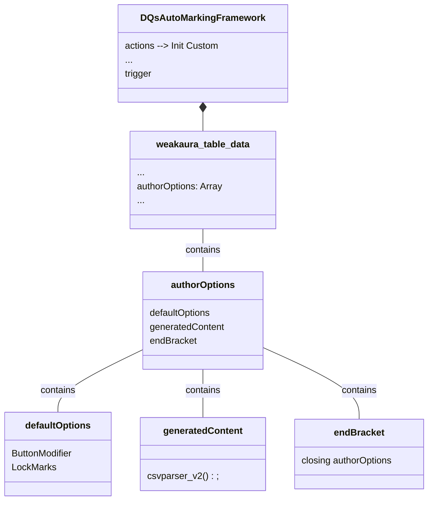

## Mermaid Data Diagram

```mermaid  
classDiagram 

DQsAutoMarkingFramework *--	 weakaura_table_data

class DQsAutoMarkingFramework {

    actions --> Init Custom
    ...
    trigger
}

 class weakaura_table_data {

    ...
    authorOptions: Array
    ...
}


  class authorOptions {
    defaultOptions
    generatedContent
    endBracket
  }

  class defaultOptions {
   ButtonModifier
   LockMarks
  }
  class endBracket {
    closing authorOptions
  }

   class generatedContent {
    csvparser_v2();
  }

weakaura_table_data -- authorOptions : contains
  authorOptions "" -- "" defaultOptions : contains
  authorOptions "" -- "" generatedContent : contains
  authorOptions "" -- "" endBracket : contains


```